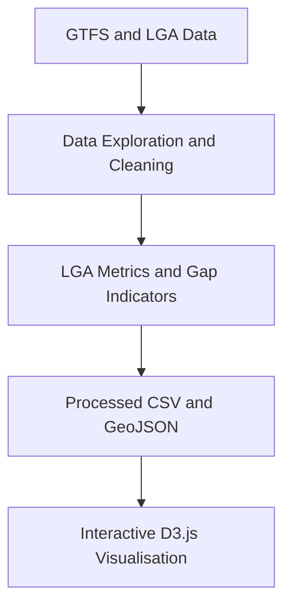

# Victorian Public Transport Inequality Explorer

# 维多利亚州公共交通服务不平等探索器

An interactive D3.js narrative visualisation that explores differences in public transport coverage, frequency, operating hours, weekend availability and mode diversity across Victorian Local Government Areas (LGAs).

这是一个基于 D3.js 的交互式叙事可视化项目，用于探索维多利亚州不同地方政府区域（LGA）在公共交通覆盖、服务频率、运营时间、周末服务和交通方式多样性方面的差异。

## Project Overview | 项目概述

**English**

The existence of public transport stops or routes does not necessarily mean that residents have access to a useful and reliable service. An area may appear well covered on a map but still experience infrequent services, short operating hours, limited weekend availability or dependence on a single transport mode.

This project combines data exploration, GTFS processing, LGA-level aggregation and interactive visualisation to examine public transport service inequality across Victoria. The project first transforms large and interconnected timetable files into a simplified analytical dataset. D3.js then presents the results through linked views that move from a statewide overview to local comparison and explanation.

**中文**

一个地区拥有公共交通站点或路线，并不代表当地居民能够获得实用、可靠的公共交通服务。某些地区在地图上可能看起来拥有较好的网络覆盖，但实际仍可能面临班次较少、运营时间较短、周末服务不足或过度依赖单一交通方式等问题。

本项目将数据探索、GTFS 数据处理、LGA 层面汇总和交互式可视化结合起来，用于分析维多利亚州各地区之间的公共交通服务不平等。项目首先将规模较大、结构复杂的时刻表数据转化为简化的分析数据集，然后使用 D3.js 通过多个联动视图展示结果，引导用户从全州概览逐步进入地区比较和原因解释。

## Business Problem | 业务问题

**English**

Public transport inequality is multidimensional. Infrastructure coverage alone cannot show whether a service is frequent, available on weekends, operational for enough hours or supported by several transport modes. Decision-makers and community members therefore need a way to identify not only where service gaps exist, but also which dimensions are driving those gaps.

The visualisation translates complex GTFS timetable records into interpretable indicators that support spatial comparison, priority identification and discussion of transport equity.

**中文**

公共交通服务不平等是一个多维度问题。仅查看基础设施覆盖情况，无法判断公共交通是否具有足够的班次、周末是否正常运营、每日服务时间是否充足，或当地是否拥有多种交通方式。因此，决策者和社区成员不仅需要识别服务差距出现在哪里，还需要理解这些差距主要由哪些因素造成。

本项目将复杂的 GTFS 时刻表记录转化为容易理解的指标，为空间比较、优先地区识别以及公共交通公平性讨论提供支持。

## Project Objectives | 项目目标

- Examine public transport service differences across Victorian LGAs.  
  分析维多利亚州不同 LGA 之间的公共交通服务差异。
- Move beyond infrastructure presence by measuring service usability and reliability.  
  不只判断公共交通设施是否存在，还评估服务的实用性与可靠性。
- Compare coverage, frequency, operating span, weekday-weekend differences and mode diversity.  
  比较覆盖、频率、运营时长、工作日与周末差异以及交通方式多样性。
- Identify LGAs with relatively large service gaps under different indicators and filters.  
  在不同指标和筛选条件下识别公共交通服务差距较大的 LGA。
- Explain why a selected LGA receives a relatively high inequality score.  
  解释所选 LGA 不平等得分较高的主要原因。
- Present technical GTFS analysis in a form that non-expert users can explore.  
  将技术性较强的 GTFS 分析转化为非专业用户也能够探索的可视化内容。

## Project Workflow | 项目流程



The project is documented in two connected parts:

本项目分为两个相互衔接的文档部分：

1. **Data Exploration and Preparation (DEP) / 数据探索与准备** - examines, cleans, joins and aggregates the GTFS and spatial data.  
   对 GTFS 和空间数据进行检查、清洗、连接与汇总。
2. **Data Visualisation Project (DVP) / 数据可视化项目** - designs and implements the interactive narrative page with D3.js.  
   使用 D3.js 设计并实现交互式叙事可视化页面。

## Data and Indicators | 数据与指标

The data exploration stage integrates GTFS tables such as `stops`, `routes`, `trips`, `stop_times` and service calendars, then aggregates the results by LGA and transport mode.

数据探索阶段连接 `stops`、`routes`、`trips`、`stop_times` 和服务日历等 GTFS 表格，然后按照 LGA 和交通方式对结果进行汇总。

### Base Service Metrics | 基础服务指标

| Metric / 指标 | Purpose / 用途 |
|---|---|
| Number of stops / 站点数量 | Measures the presence of public transport infrastructure / 衡量公共交通基础设施覆盖 |
| Number of routes / 路线数量 | Measures available route choices / 衡量可选择的线路数量 |
| Number of trips / 班次数量 | Represents scheduled service supply / 反映计划服务供给 |
| Weekday stop events / 工作日到站事件 | Measures weekday service activity / 衡量工作日服务活动 |
| Weekend stop events / 周末到站事件 | Measures weekend service activity / 衡量周末服务活动 |
| First and last service hour / 首末班时间 | Shows the daily service window / 展示每日服务时间范围 |
| Service span / 运营时长 | Measures how long services operate each day / 衡量每日运营持续时间 |
| Stop density / 站点密度 | Compares spatial service coverage / 比较空间服务覆盖 |
| Route density / 路线密度 | Compares route availability relative to area / 比较相对于区域面积的路线供给 |
| Events per stop / 单站服务事件 | Represents service intensity at available stops / 反映现有站点的服务强度 |

### Gap Indicators | 差距指标

- Coverage gap / 覆盖差距
- Frequency gap / 频率差距
- Service span gap / 运营时长差距
- Weekday-weekend gap / 工作日与周末差距
- Mode diversity gap / 交通方式多样性差距
- Overall inequality score / 综合不平等得分

The processed outputs used by the web page are:

D3 页面读取的处理后数据包括：

```text
data/processed/lga_metrics.csv
data/processed/vic_lga_2025_simplified.geojson
```

## Interactive Visualisation | 交互式可视化

The page follows the principle of **overview first, filter and compare, then details on demand**. Each linked view answers a different question.

页面遵循“先看整体、再筛选和比较、最后按需查看细节”的叙事结构。每个联动视图回答一个不同的问题。

| View / 视图 | Analytical question / 分析问题 |
|---|---|
| Control panel / 控制面板 | Which region, mode, metric and Top N should be explored? / 用户希望查看哪个地区、交通方式、指标和排名范围？ |
| Choropleth map / 分级设色地图 | Where are the strongest service gaps located? / 服务差距较大的地区在哪里？ |
| Ranking bar chart / 排名条形图 | Which LGAs are the most underserved under the selected metric? / 在所选指标下，哪些 LGA 的服务最不足？ |
| LGA profile / LGA 指标概况 | Which dimensions contribute to the selected area's inequality? / 哪些维度造成了所选地区的不平等？ |
| Service span chart / 服务时段图 | How early does service begin and how late does it operate? / 公共交通从几点开始、运营到几点？ |
| Weekday-weekend dumbbell chart / 工作日与周末哑铃图 | How much does service availability change on weekends? / 周末服务水平发生了多大变化？ |
| Coverage-intensity bubble chart / 覆盖与强度气泡图 | Does an area have both sufficient coverage and service intensity? / 一个地区是否同时拥有足够的覆盖和服务强度？ |
| Conclusion matrix / 结论矩阵 | What is the main source of inequality for the selected area? / 所选地区公共交通不平等的主要来源是什么？ |

## Interaction Design | 交互设计

- Users can filter by region type: Inner Melbourne, Outer Melbourne or Regional Victoria.  
  用户可以按照墨尔本内城区、墨尔本外城区或维州区域地区进行筛选。
- Users can switch between All, Bus, Train and Tram modes.  
  用户可以切换全部、公交车、火车和有轨电车模式。
- Users can switch between multiple inequality indicators.  
  用户可以切换不同的公共交通不平等指标。
- The ranking chart can display the Top 5, Top 10 or Top 20 LGAs.  
  排名图可以显示前 5、前 10 或前 20 个 LGA。
- Up to three LGAs can be selected from the map or ranking chart for comparison.  
  用户可以从地图或排名图中选择最多三个 LGA 进行比较。
- Selected LGAs retain consistent colours across all linked views.  
  所选 LGA 在所有联动图表中保持一致的颜色。
- The map supports tooltips, zooming and panning.  
  地图支持提示框、缩放和平移。
- A reset control restores the default filters, map view and selections.  
  重置按钮可以恢复默认筛选、地图位置和选择状态。

## Technology Stack | 技术栈

| Area / 部分 | Tools / 工具 |
|---|---|
| Data exploration and preparation / 数据探索与准备 | R, GTFS processing, spatial analysis |
| Data outputs / 数据输出 | CSV, GeoJSON |
| Web structure / 网页结构 | HTML5 |
| Styling and responsive layout / 样式与响应式布局 | CSS3 |
| Interaction and application logic / 交互与应用逻辑 | Vanilla JavaScript |
| Data visualisation / 数据可视化 | D3.js v7 |
| Local development / 本地开发 | Visual Studio Code, Live Server |
| Version control and deployment / 版本管理与部署 | GitHub, GitHub Pages |

## Repository Structure | 仓库结构

```text
victorian-public-transport-inequality-explorer/
├── README.md
├── index.html
├── .gitignore
├── analysis/
│   ├── 01-data-audit.R
│   ├── 02-gtfs-joins.R
│   ├── 03-lga-aggregation.R
│   ├── 04-indicator-calculation.R
│   └── 05-export-for-d3.R
├── data/
│   ├── README.md
│   └── processed/
│       ├── lga_metrics.csv
│       └── vic_lga_2025_simplified.geojson
├── css/
│   └── style.css
├── js/
│   └── main.js
├── assets/
│   └── images/
└── documentation/
    ├── 01-data-exploration/
    │   ├── README.md
    │   └── DEP-Report-public.pdf
    └── 02-data-visualisation/
        ├── README.md
        ├── DVP-Report-public.pdf
        └── design-sheets/
```

## Project Documentation | 项目文档

### 1. Data Exploration and Preparation | 数据探索与准备

Explains the source data, initial audit, GTFS joins, spatial aggregation, indicator calculation, data-quality issues and final processed outputs.

介绍数据来源、初始检查、GTFS 表格连接、空间汇总、指标计算、数据质量问题以及最终输出数据。

- [Read the Data Exploration Documentation / 阅读数据探索文档](数据探索与处理文档DEP/README.md)
- [View the Public DEP Report / 查看公开版DEP报告](数据可视化与D3页面文档DVP.pdf)

### 2. Interactive Data Visualisation | 交互式数据可视化

Explains the Five Design-Sheet process, chart selection, narrative structure, visual variables, linked interactions, technical implementation and usage instructions.

介绍五张设计图方法、图表选择、叙事结构、视觉变量、联动交互、技术实现和页面使用方法。

- [Read the Data Visualisation Documentation / 阅读数据可视化文档](documentation/02-data-visualisation/README.md)
- [View the Public DVP Report / 查看公开版DVP报告](documentation/02-data-visualisation/DVP-Report-public.pdf)

## Running the Visualisation Locally | 本地运行方法

Because the page loads CSV and GeoJSON files, it should be opened through a local web server rather than by double-clicking `index.html`.

由于页面需要加载 CSV 和 GeoJSON 文件，因此应通过本地服务器运行，而不是直接双击 `index.html`。

### Option 1: VS Code Live Server | 方法一：VS Code Live Server

1. Open the complete repository folder in Visual Studio Code.  
   在 Visual Studio Code 中打开整个项目文件夹。
2. Install the **Live Server** extension.  
   安装 **Live Server** 扩展。
3. Right-click `index.html`.  
   右键点击 `index.html`。
4. Select **Open with Live Server**.  
   选择 **Open with Live Server**。

### Option 2: Python Local Server | 方法二：Python本地服务器

From the repository root, run:

在项目根目录运行：

```bash
python -m http.server 8000
```

Then open:

然后在浏览器中打开：

```text
http://localhost:8000
```

## Main Insights | 主要洞察

- Public transport infrastructure coverage and service usability are not the same.  
  公共交通基础设施覆盖和服务实用性并不相同。
- An area with stops or routes may still experience low frequency or short operating hours.  
  一个地区即使拥有站点或路线，也可能面临班次较少或运营时间较短的问题。
- Weekend service can be substantially weaker than weekday service in some areas.  
  一些地区的周末服务可能明显弱于工作日服务。
- Different LGAs can receive similar overall scores for different underlying reasons.  
  不同 LGA 可能获得相似的综合得分，但背后的原因并不相同。
- Linked views help users move from identifying underserved areas to understanding the structure of their service gaps.  
  联动视图可以帮助用户从识别服务不足地区进一步理解差距结构。

## Limitations | 项目局限性

- The analysis is based mainly on scheduled GTFS supply and does not represent actual service performance or delays.  
  分析主要基于 GTFS 计划服务，不能代表实际运营表现或延误情况。
- Aggregation at LGA level can hide differences within an LGA.  
  LGA 层面的汇总可能掩盖同一 LGA 内部的差异。
- Gap scores depend on indicator definitions, normalisation and weighting choices.  
  差距得分会受到指标定义、标准化和权重设置的影响。
- The current model focuses on transport supply and does not fully incorporate population or demand-side needs.  
  当前模型主要分析公共交通供给，尚未充分加入人口和需求侧因素。
- Static timetable data cannot capture temporary cancellations, disruptions or infrastructure failures.  
  静态时刻表数据无法反映临时取消、运营中断或基础设施故障。

## Future Improvements | 未来改进

- Add population, employment, age, disability and social-service demand indicators.  
  加入人口、就业、年龄、残障和社会服务需求指标。
- Compare scheduled services with real-time or observed service performance.  
  将计划服务与实时或实际运营表现进行比较。
- Add clearer first-time user guidance and annotations.  
  为首次使用者增加更明确的操作引导和图表注释。
- Improve responsive behaviour for Top 20 rankings and three-LGA comparison.  
  优化前 20 名排名和三个 LGA 对比在不同屏幕尺寸下的显示效果。
- Conduct usability testing with community members and non-expert policy readers.  
  邀请社区成员和非专业政策读者开展可用性测试。

## Author | 作者

**Kun Zhou / 周坤**  
Individual academic data exploration and visualisation project, 2026  
个人学术数据探索与可视化项目，2026

