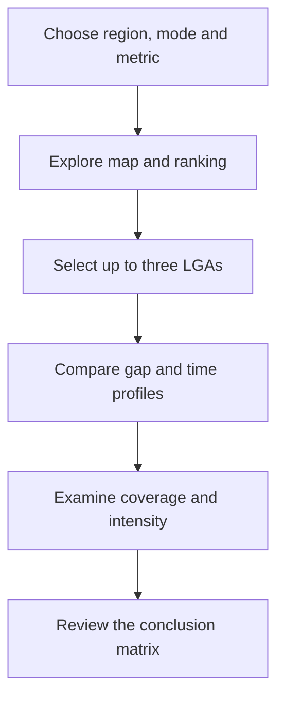
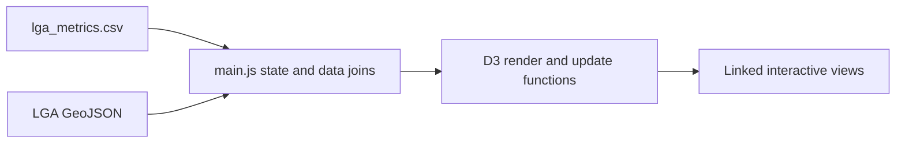
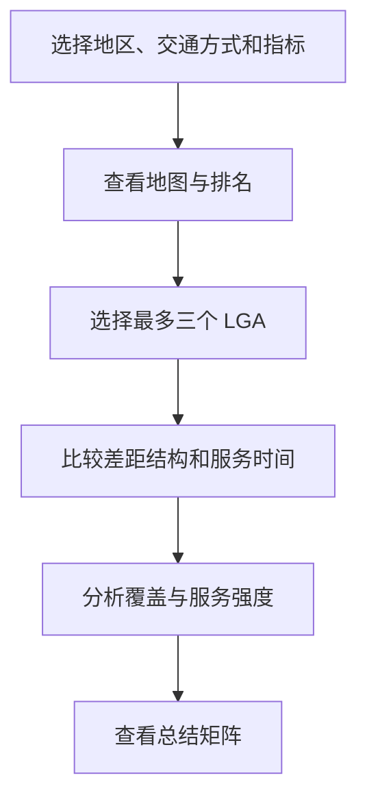
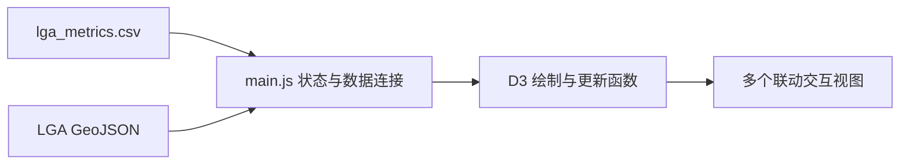

# Interactive Data Visualisation and D3.js Implementation

# 交互式数据可视化与 D3.js 页面实现

[English](#english) | [中文](#中文)

This document explains the design and implementation of the interactive D3.js component of the **Victorian Public Transport Inequality Explorer**. It covers the visualisation design process, narrative structure, linked views, interaction logic, technical architecture and instructions for running the page.

本文档介绍 **Victorian Public Transport Inequality Explorer（维多利亚州公共交通服务不平等探索器）** 的 D3.js 交互式可视化部分，包括可视化设计过程、叙事结构、联动图表、交互逻辑、技术架构和页面运行方法。

> **Scope note / 范围说明：** The indicators displayed by the page are calculated during the upstream data-exploration and preparation stage. This document focuses on how those indicators are communicated and explored in the browser. / 页面使用的指标在前一阶段的数据探索与准备过程中完成计算。本文档重点说明如何在浏览器中展示、比较和解释这些指标。

---

<a id="english"></a>

## English

### 1. Visualisation purpose

Public transport accessibility cannot be understood only by checking whether an area has stops, stations or routes. An LGA may appear to be covered by a network but still have low service frequency, short operating hours, weak weekend service or limited mode choice.

The visualisation therefore treats public transport inequality as a multidimensional service-supply problem. Its purpose is to help users:

1. identify where relatively large service gaps occur;
2. compare underserved LGAs under different indicators;
3. understand which dimensions contribute to an LGA's result;
4. explore differences by region and transport mode; and
5. move from a statewide overview to a local explanation.

### 2. Target audience

The primary audience includes members of the public, local communities and non-technical policy readers interested in public transport equity in Victoria. The interface is designed for users who understand the everyday importance of getting to work, education and social activities, but may not be familiar with GTFS, spatial analysis or indicator normalisation.

For this reason, the page combines short narrative guidance with interactive exploration rather than presenting the user with raw timetable tables or one highly complex chart.

### 3. Design process

The project follows the **Five Design-Sheet methodology**. The design evolved through five stages:

| Sheet | Design direction | Contribution to the final page |
|---|---|---|
| Sheet 1 | Broad ideation | Explored spatial, ranking, temporal, multi-indicator and summary views |
| Sheet 2 | Time-first: *The Rhythm of Inequality* | Contributed the service-span and weekday/weekend comparisons |
| Sheet 3 | Geography-first: *The Geography of Inequality* | Established the choropleth map as the main entry point |
| Sheet 4 | Gap-first: *The Structure of Inequality* | Contributed the ranking and indicator-breakdown views |
| Sheet 5 | Final hybrid: *Public Transport Inequality Explorer* | Combined overview, filtering, comparison, explanation and summary |

The final design follows a guided-exploration model. It is more structured than an open dashboard but more flexible than a linear slideshow.

### 4. What–why–how framework

| Dimension | Application in this project |
|---|---|
| What | LGA-level public transport service metrics and derived gap indicators |
| Why | Identify, filter, compare and explain service-supply inequality |
| How | Linked maps, charts, profiles, tooltips, filters and persistent selections |

The narrative sequence applies the principle **“overview first, zoom and filter, then details on demand.”**



### 5. Page structure and linked views

Each view answers a specific analytical question while sharing the same filters and selected LGAs.

| View | Main question | Visual encoding and role |
|---|---|---|
| Control panel | What subset of the data should be explored? | Region, mode, metric and Top N controls |
| Choropleth map | Where are stronger service gaps located? | LGA position and sequential colour intensity |
| Ranked bar chart | Which LGAs are most underserved under the current lens? | Ordered bars using length for comparison |
| LGA profile | Why does a selected LGA receive its result? | Bars comparing gap dimensions |
| Service-span chart | How early does service start and how late does it finish? | First-to-last-service intervals with a 9 pm reference |
| Weekday/weekend dumbbell chart | How much does scheduled service change on weekends? | Two endpoints and a connecting line for stop-event differences |
| Coverage–intensity bubble chart | Is an area merely covered, or is it also well served? | Stop density on x, events per stop on y, stop events as size |
| Conclusion matrix | What is the main service pattern by mode? | Compact mode-level summary of coverage, median gap and main gap |

#### 5.1 Control panel

The control panel is placed at the beginning of the page and provides four dimensions:

- **Region:** All areas, Inner Melbourne, Outer Melbourne or Regional Victoria
- **Mode:** All, Bus, Train or Tram
- **Metric:** Overall inequality score, coverage gap, frequency gap, service-span gap or weekend–weekday gap
- **Top N:** Top 5, Top 10 or Top 20 LGAs

The controls update the relevant views together, allowing the user to reorganise the story without navigating to a different page.

#### 5.2 Choropleth map and ranking

The map provides the statewide spatial overview. Darker sequential colour represents a larger gap under the selected metric. Hovering over an LGA displays a tooltip containing its name, region, active mode, current metric value and selected service measures.

The map supports zooming and panning through D3's zoom behaviour. This is particularly useful for dense metropolitan LGAs. The ranking chart complements the map by ordering the most underserved LGAs under the current filters. Clicking either a map area or a ranking bar selects that LGA.

#### 5.3 Local profile and service span

The LGA profile breaks the overall result into coverage, frequency, service span, weekend–weekday and mode-diversity gaps. When more than one LGA is selected, the panel changes to a comparison view.

The service-span chart shows the first and last recorded service times for Bus, Train and Tram. A 9 pm reference line helps users judge evening availability. Times after midnight are displayed as part of the continuing service day rather than being moved to the beginning of the axis.

#### 5.4 Weekday/weekend comparison and bubble chart

The dumbbell chart compares weekday and weekend stop events. It displays the current Top N LGAs and keeps selected LGAs visible even when they fall outside that ranking.

The bubble chart compares two different dimensions of service provision:

- x-axis: stop density, log transformed;
- y-axis: GTFS events per stop, log transformed;
- bubble size: total GTFS stop events; and
- bubble colour: the currently selected inequality metric.

This view separates physical network coverage from the intensity of service delivered through that network.

#### 5.5 Conclusion matrix

The conclusion matrix summarises the preceding views by transport mode. It reports how many LGAs have service, the median gap score, the main gap and the most underserved LGA. It acts as the end of the narrative rather than replacing the detailed charts.

### 6. Interaction model

The page uses a shared interaction state so that the same user choices are reflected across the visualisation.

#### LGA selection

- Users can select an LGA from the map or ranking chart.
- Up to three LGAs can be compared at the same time.
- Each selected LGA receives a distinct highlight colour.
- The same colour is retained across all linked views.
- Clicking a selected LGA again removes it.
- Selecting a fourth LGA replaces the earliest current selection.
- Selected LGAs remain visible in later charts even if they are outside the active Top N.

#### Map behaviour

- Hovering displays contextual details.
- Scrolling zooms the map.
- Dragging pans the map.
- Selecting an LGA does not reset the user's current zoom position.

#### Reset behaviour

The reset control restores the default region, mode, metric, Top N, map position and LGA selections.

### 7. Visual design decisions

#### Visual variables

- Geographic position represents LGA location.
- Sequential colour lightness represents ordered gap values.
- Bar length supports accurate comparison.
- x/y position shows the coverage–intensity relationship.
- Bubble size adds service-activity scale.
- Persistent selection colours help users track the same LGA across views.

#### Colour and layout

The interface uses a light warm background to reduce the brightness of a pure-white page while maintaining chart contrast. Colour is used for values, selection and interaction feedback rather than decoration. Views are placed in a consistent card-based layout with short narrative headings and explanatory text.

#### Narrative style

The interface uses guided exploration. The page provides an intended reading order—spatial pattern, ranking, local explanation, temporal comparison, coverage versus intensity and summary—while still allowing users to change filters and investigate their own LGAs.

### 8. Technical implementation

The visualisation is built with:

| Layer | Technology |
|---|---|
| Page structure | HTML5 |
| Styling and responsive layout | CSS3 |
| Application and interaction logic | Vanilla JavaScript |
| Visualisation | D3.js v7 |
| Metrics | Processed CSV |
| Boundaries | Simplified GeoJSON |

The front end uses processed LGA-level files rather than parsing the raw GTFS package in the browser. This reduces loading and interaction costs and keeps the visualisation logic separate from the more computationally expensive preparation work.



### 9. Data interface

The page requires two processed files:

| File | Purpose |
|---|---|
| `data/processed/lga_metrics.csv` | LGA- and mode-level service measures, gap indicators and overall scores |
| `data/processed/vic_lga_2025_simplified.geojson` | Simplified Victorian LGA geometries used by the choropleth map |

The two files must share a consistent LGA identifier or LGA name so that each metric record can be joined to the correct geometry. Indicator definitions and preparation steps are documented in the [Data Exploration and Preparation README](../01-data-exploration/README.md).

### 10. Required project files

```text
victorian-public-transport-inequality-explorer/
├── index.html
├── css/
│   └── style.css
├── js/
│   └── main.js
├── data/
│   └── processed/
│       ├── lga_metrics.csv
│       └── vic_lga_2025_simplified.geojson
└── documentation/
    └── 02-data-visualisation/
        ├── README.md
        ├── DVP-Report-public.pdf
        └── design-sheets/
```

### 11. Running the page locally

The page loads CSV and GeoJSON files asynchronously, so it must be served through a local web server. Opening `index.html` directly may block the data requests.

#### Option A: VS Code Live Server

1. Open the repository folder in Visual Studio Code.
2. Install the **Live Server** extension.
3. Right-click `index.html`.
4. Select **Open with Live Server**.

#### Option B: Python local server

Run the following command from the repository root:

```bash
python -m http.server 8000
```

Then open:

```text
http://localhost:8000
```

### 12. User guide

1. Choose a region, mode, inequality metric and Top N value.
2. Read the map for the spatial pattern and the ranking for priority LGAs.
3. Hover over the map for details.
4. Click an LGA on the map or ranking chart to begin a local explanation.
5. Select up to two more LGAs for comparison.
6. Review the profile, service-span, weekday/weekend and bubble views.
7. Use the conclusion matrix to return to the overall pattern.
8. Use **Reset view** to restore the initial state.

### 13. Design and implementation limitations

- The gap indicators are supply-side proxies derived from scheduled GTFS data; they are not population-adjusted accessibility measures.
- Overall scores depend on the upstream indicator definitions, normalisation and weighting choices.
- A choropleth map can visually overemphasise large regional LGAs.
- Top 20 rankings and three-LGA comparisons can become crowded on smaller screens.
- The current design needs further systematic testing across screen sizes and browsers.
- Some interactions, including multi-selection and zoom/pan, may not be immediately obvious to first-time users.
- Demand-side variables such as population, employment density and social-service needs are not included.
- Further accessibility work should test keyboard navigation, screen-reader labels, focus states and colour-vision compatibility.

### 14. Future improvements

- Add a short onboarding guide for first-time users.
- Strengthen mobile and tablet layouts.
- Add demand-side indicators and population-normalised comparisons.
- Provide downloadable filtered results.
- Add clearer chart annotations and explanations of score construction.
- Conduct usability and accessibility testing with target users.
- Deploy the project through GitHub Pages after validating all relative paths.

### 15. Related files

- [View the public DVP report](DVP-Report-public.pdf)
- [Read the data exploration documentation](../数据探索与处理文档DEP/README.md)
- [Return to the main project README](../../README.md)

---

<a id="中文"></a>

## 中文

### 1. 可视化目的

判断公共交通是否可达，不能只看一个地区是否拥有站点、车站或线路。某个 LGA 在地图上可能已经被公共交通网络覆盖，但居民仍可能面对班次较少、运营时间较短、周末服务不足或交通方式选择有限等问题。

因此，本页面把公共交通服务不平等视为一个多维度的供给问题，主要帮助用户：

1. 识别服务差距相对较大的地区；
2. 根据不同指标比较服务不足的 LGA；
3. 理解哪些维度影响了一个 LGA 的分析结果；
4. 按地区类型和交通方式探索差异；
5. 从全州概览逐步进入地区层面的解释。

### 2. 目标用户

本项目的主要目标用户包括普通公众、当地社区成员，以及关注维多利亚州公共交通公平问题的非技术型政策读者。这些用户通常能够从日常生活中理解公共交通对上班、上学和社交活动的重要性，但不一定熟悉 GTFS、空间分析或指标标准化。

因此，页面将简短的叙事说明与交互探索结合起来，而不是直接展示复杂的原始时刻表或把所有信息放进一张大型图表。

### 3. 设计过程

项目采用 **Five Design-Sheet（五张设计图）方法**，经历了五个阶段：

| 设计图 | 设计方向 | 对最终页面的贡献 |
|---|---|---|
| Sheet 1 | 广泛构思 | 探索空间、排名、时间、多指标解释和总结视图 |
| Sheet 2 | 时间优先：*The Rhythm of Inequality* | 形成服务时长和工作日/周末比较图 |
| Sheet 3 | 地理优先：*The Geography of Inequality* | 确定将分级设色地图作为主要入口 |
| Sheet 4 | 差距优先：*The Structure of Inequality* | 形成排名和指标拆解视图 |
| Sheet 5 | 最终混合方案：*Public Transport Inequality Explorer* | 将概览、筛选、比较、解释和总结整合起来 |

最终设计采用“引导式探索”模式：它比完全开放的 Dashboard 更有结构，但又比线性幻灯片提供更多探索自由。

### 4. What–Why–How 框架

| 维度 | 在本项目中的应用 |
|---|---|
| What / 展示什么 | LGA 层面的公共交通服务指标和衍生差距指标 |
| Why / 为什么展示 | 识别、筛选、比较并解释公共交通服务不平等 |
| How / 如何展示 | 使用联动地图、图表、指标概况、提示框和筛选器 |

页面叙事顺序遵循“**先看概览，再缩放和筛选，最后按需查看细节**”的原则。



### 5. 页面结构与联动视图

每个视图回答一个不同的分析问题，同时共享相同的筛选条件和 LGA 选择状态。

| 视图 | 主要问题 | 视觉编码与作用 |
|---|---|---|
| 控制面板 | 用户想探索哪一部分数据？ | 地区、交通方式、指标和 Top N 控件 |
| 分级设色地图 | 服务差距较大的地区在哪里？ | 使用 LGA 位置和连续颜色深浅 |
| 排名条形图 | 当前条件下哪些 LGA 服务最不足？ | 使用排序和条形长度进行比较 |
| LGA 指标概况 | 为什么所选 LGA 获得这一结果？ | 使用条形图拆解不同差距维度 |
| 服务时段图 | 服务多早开始、多晚结束？ | 首末班时间区间和晚上 9 点参考线 |
| 工作日/周末哑铃图 | 周末服务发生了多大变化？ | 两个端点和连接线表示到站事件差异 |
| 覆盖–强度气泡图 | 一个地区只是拥有覆盖，还是同时拥有较好的服务？ | x 轴为站点密度，y 轴为单站事件数，气泡大小为到站事件总量 |
| 总结矩阵 | 不同交通方式的主要服务结构是什么？ | 汇总服务覆盖、中位差距和主要差距 |

#### 5.1 控制面板

控制面板位于页面开头，包含四个筛选维度：

- **地区：** 全部、墨尔本内城区、墨尔本外城区、维州区域地区
- **交通方式：** 全部、Bus、Train、Tram
- **指标：** 综合不平等得分、覆盖差距、频率差距、服务时长差距、工作日–周末差距
- **Top N：** 前 5、前 10 或前 20 个 LGA

更改控件后，相关视图会同步更新，因此用户不需要跳转到其他页面。

#### 5.2 分级设色地图与排名图

地图提供全州空间概览。连续色阶越深，表示所选指标下的差距越大。鼠标悬停在 LGA 上时，提示框会显示 LGA 名称、地区类型、当前交通方式、当前指标值及相关服务数据。

地图使用 D3 的 zoom 行为实现缩放和平移，适合查看密集的都市区 LGA。右侧排名图按照当前筛选条件对服务不足的 LGA 进行排序。用户可以通过点击地图区域或排名条形来选择 LGA。

#### 5.3 LGA 指标概况与服务时段

LGA 指标概况将综合结果拆解为覆盖、频率、服务时长、工作日–周末和交通方式多样性差距。选择多个 LGA 后，该区域会自动切换为比较视图。

服务时段图展示 Bus、Train 和 Tram 的最早及最晚服务时间，并加入晚上 9 点参考线。午夜后的时间继续显示在同一个服务日时间轴上，而不是移动到时间轴开头。

#### 5.4 工作日/周末比较与气泡图

哑铃图比较工作日和周末的 GTFS 到站事件。图表显示当前 Top N，同时会保留用户已选择但不在 Top N 中的 LGA，保证后续分析不会中断。

气泡图比较公共交通覆盖和服务强度：

- x 轴：站点密度，使用对数转换；
- y 轴：每个站点的 GTFS 事件数量，使用对数转换；
- 气泡大小：GTFS 到站事件总量；
- 气泡颜色：当前选择的不平等指标。

该视图用于区分“拥有公共交通网络覆盖”和“网络提供足够服务强度”这两个不同问题。

#### 5.5 总结矩阵

总结矩阵按交通方式汇总前面的分析，包括拥有服务的 LGA 数量、中位差距得分、主要差距和服务最不足的 LGA。它是整个叙事的总结，而不是对前面详细图表的替代。

### 6. 交互逻辑

页面使用共享状态管理筛选条件和 LGA 选择，使所有图表能够保持一致。

#### LGA 选择

- 用户可以从地图或排名图中选择 LGA。
- 最多可以同时比较三个 LGA。
- 每个所选 LGA 使用不同的高亮颜色。
- 相同颜色会在所有联动视图中保持一致。
- 再次点击已选 LGA 可以取消选择。
- 选择第四个 LGA 时，最早选择的 LGA 会被自动替换。
- 即使某个已选 LGA 不在当前 Top N 中，它仍会保留在后续分析图中。

#### 地图交互

- 悬停显示详细提示信息。
- 滚动鼠标滚轮可以缩放。
- 拖动地图可以平移。
- 选择 LGA 后不会自动重置当前缩放位置。

#### 重置功能

重置按钮会恢复默认地区、交通方式、指标、Top N、地图位置和 LGA 选择。

### 7. 视觉设计决策

#### 视觉变量

- 地理位置表示 LGA 所在位置。
- 连续色阶的深浅表示有顺序的差距数值。
- 条形长度用于较准确地比较大小。
- x/y 位置展示覆盖和强度之间的关系。
- 气泡大小补充服务活动规模。
- 一致的选择颜色帮助用户在不同图表中追踪同一个 LGA。

#### 颜色与布局

界面使用浅暖色背景，降低纯白页面的强烈亮度，同时保持图表对比度。颜色主要用于数值、选择和交互反馈，而不是装饰。不同视图采用统一的卡片式布局，并配合简短的叙事标题和说明。

#### 叙事方式

页面采用引导式探索，推荐阅读顺序为：空间分布、排名、地区解释、时间差异、覆盖与强度、总结。与此同时，用户仍然可以自由更改筛选条件并查看自己关注的 LGA。

### 8. 技术实现

| 层级 | 使用技术 |
|---|---|
| 页面结构 | HTML5 |
| 样式与响应式布局 | CSS3 |
| 应用与交互逻辑 | Vanilla JavaScript |
| 数据可视化 | D3.js v7 |
| 指标数据 | 处理后的 CSV |
| 地理边界 | 简化后的 GeoJSON |

前端直接读取处理后的 LGA 层面数据，而不是在浏览器中解析完整的原始 GTFS 数据包。这样可以降低加载和交互成本，并将数据准备与前端可视化逻辑分开。



### 9. 数据接口

页面需要读取两个处理后文件：

| 文件 | 用途 |
|---|---|
| `data/processed/lga_metrics.csv` | 保存 LGA 和交通方式层面的服务指标、差距指标与综合得分 |
| `data/processed/vic_lga_2025_simplified.geojson` | 保存分级设色地图使用的维多利亚州 LGA 简化边界 |

两个文件必须使用一致的 LGA 标识或 LGA 名称，确保指标记录能够连接到正确的地图区域。指标定义和准备步骤请参阅[数据探索与准备 README](../01-data-exploration/README.md)。

### 10. 必需的项目文件

```text
victorian-public-transport-inequality-explorer/
├── index.html
├── css/
│   └── style.css
├── js/
│   └── main.js
├── data/
│   └── processed/
│       ├── lga_metrics.csv
│       └── vic_lga_2025_simplified.geojson


### 11. 本地运行方法

页面需要异步读取 CSV 和 GeoJSON，因此必须通过本地服务器运行。直接双击 `index.html` 可能导致浏览器阻止数据请求。

#### 方法一：VS Code Live Server

1. 在 Visual Studio Code 中打开完整仓库文件夹。
2. 安装 **Live Server** 扩展。
3. 右键点击 `index.html`。
4. 选择 **Open with Live Server**。

#### 方法二：Python 本地服务器

在仓库根目录运行：

```bash
python -m http.server 8000
```

然后在浏览器中打开：

```text
http://localhost:8000
```

### 12. 页面使用步骤

1. 选择地区、交通方式、不平等指标和 Top N。
2. 通过地图了解空间分布，通过排名图识别优先地区。
3. 将鼠标移动到地图上查看详细信息。
4. 点击地图区域或排名条形，开始查看 LGA 解释。
5. 最多再选择两个 LGA 进行比较。
6. 查看指标概况、服务时段、工作日/周末和气泡图。
7. 使用总结矩阵重新回到整体模式。
8. 使用 **Reset view** 恢复初始状态。

### 13. 设计与实现局限性

- 差距指标是根据计划 GTFS 数据建立的服务供给代理指标，不是经过人口调整的可达性指标。
- 综合得分会受到前期指标定义、标准化和权重选择的影响。
- 分级设色地图可能在视觉上过度突出面积较大的区域 LGA。
- 在小屏幕上同时展示 Top 20 和三个 LGA 比较时，图表可能较拥挤。
- 当前设计仍需要在不同屏幕尺寸和浏览器上进行系统测试。
- 多选、地图缩放和平移等交互对第一次使用页面的用户可能不够明显。
- 当前数据没有加入人口、就业密度和社会服务需求等需求侧变量。
- 后续还需要测试键盘操作、屏幕阅读器标签、焦点状态和色觉兼容性。

### 14. 未来改进

- 为第一次使用页面的用户增加简短引导。
- 加强手机和平板设备布局。
- 加入需求侧指标和人口标准化比较。
- 允许下载筛选后的分析结果。
- 增加图表注释和综合得分计算说明。
- 面向目标用户开展可用性和无障碍测试。
- 检查所有相对路径后，通过 GitHub Pages 部署项目。

### 15. 相关文件

- [查看公开版 DVP 报告](DVP-Report-public.pdf)
- [阅读数据探索与准备文档](../数据探索与处理文档DEP/README.md)
- [返回项目总 README](../../README.md)

---

## References / 参考文献

1. Munzner, T. (2014). *Visualization Analysis and Design*. CRC Press. [DOI](https://doi.org/10.1201/b17511)
2. Aigner, W., Miksch, S., Schumann, H., & Tominski, C. (2023). *Visualization of Time-Oriented Data* (2nd ed.). Springer. [DOI](https://doi.org/10.1007/978-1-4471-7527-8)
3. Shneiderman, B. (1996). The eyes have it: A task by data type taxonomy for information visualizations. [DOI](https://doi.org/10.1109/VL.1996.545307)
4. Tufte, E. R. (2001). *The Visual Display of Quantitative Information* (2nd ed.). Graphics Press.
5. Johnson, J. (2014). *Designing with the Mind in Mind* (2nd ed.). Morgan Kaufmann. [DOI](https://doi.org/10.1016/C2012-0-07128-1)

## Author / 作者

**Kun Zhou / 周坤**

This repository is presented as a data analytics and visualisation portfolio project. Personal identifiers from the submitted academic report have been removed from the public documentation.

本仓库用于商业分析、数据分析与数据可视化个人作品展示。公开文档已移除提交版学术报告中的个人身份信息。
