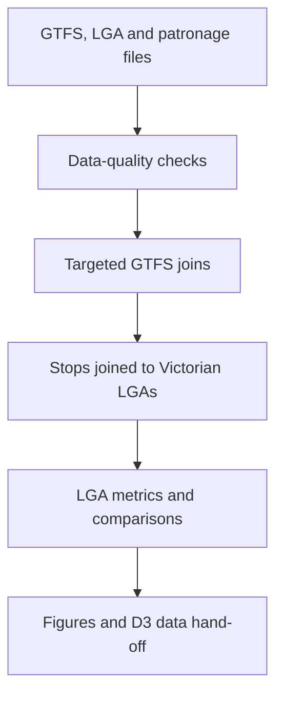
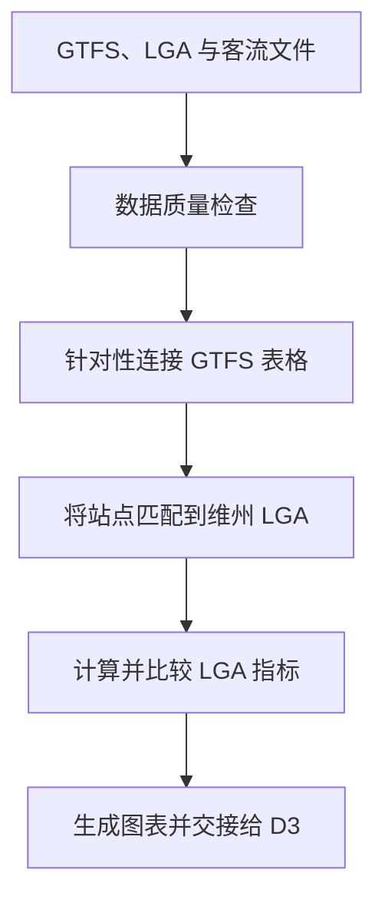

# Data Exploration and Preparation (DEP)

# 数据探索与准备

[English](#english) | [中文](#中文)

This document explains the exploratory analysis behind the **Victorian Public Transport Inequality Explorer**. It records how Victorian public transport timetable and spatial data were audited, joined, aggregated and analysed in R before being prepared for the interactive D3.js visualisation.

本文档介绍 **Victorian Public Transport Inequality Explorer（维多利亚州公共交通服务不平等探索器）** 的数据探索过程，说明如何使用 R 对维多利亚州公共交通时刻表和空间数据进行质量检查、连接、汇总与分析，并为后续 D3.js 交互式可视化提供依据。

> **Scope note / 范围说明：** This README documents the submitted DEP report and its R script. It describes scheduled service supply rather than actual on-time performance or passenger demand. / 本 README 根据已完成的 DEP 报告及其 R 代码编写，研究对象是计划公共交通服务供给，而不是实际准点率或乘客需求。

---

## English

### 1. Project purpose

The presence of a public transport stop does not necessarily mean that useful service is available. Service can differ by transport mode, location, time of day and day type. This exploration therefore examines how scheduled public transport supply varies across Victorian Local Government Areas (LGAs), with particular attention to spatial coverage, service intensity, mode variety and operating span.

The analysis is designed to answer three questions:

1. How do service availability and stop coverage vary by transport mode, time band and weekday/weekend status?
2. What patterns emerge when stop density, service frequency, mode variety and service hours are compared across LGAs?
3. Do LGAs follow one consistent relationship between spatial reach and service concentration, or do multiple service structures emerge?

### 2. Data sources

| Dataset | Role in the analysis | Source |
|---|---|---|
| Victorian public transport GTFS Schedule | Core source for stops, trips, routes, departure times and service calendars | [Department of Transport and Planning](https://opendata.transport.vic.gov.au/dataset/gtfs-schedule) |
| Local Government Areas 2025, GDA2020 | LGA boundaries and area values used for spatial joins and density calculations | [Australian Bureau of Statistics](https://www.abs.gov.au/statistics/standards/australian-statistical-geography-standard-asgs-edition-3/jul2021-jun2026/access-and-downloads/digital-boundary-files) |
| Monthly average patronage by day type and mode | Supplementary dataset checked during exploration; not used in the final core metrics | [Department of Transport and Planning](https://opendata.transport.vic.gov.au/dataset/monthly-average-patronage-by-day-type-and-by-mode) |

The GTFS package contained eight feeds. Six were grouped into the three modes used in the main analysis:

| Analytical mode | Included feeds |
|---|---|
| Train | Interstate train, metropolitan train and regional train |
| Bus | Myki bus and regional bus |
| Tram | Metropolitan tram |

Regional coach and SkyBus were inspected as part of the original GTFS package but were not included in the three-mode comparison.

### 3. Analytical workflow

#### 3.1 Data audit

Six core GTFS tables were reviewed: `stops`, `stop_times`, `trips`, `routes`, `calendar` and `calendar_dates`. The audit checked:

- missing values in the key fields required by the analysis;
- unmatched `trip_id`, `stop_id`, `route_id` and `service_id` keys;
- the completeness and readability of the LGA boundary layer;
- missing values in the supplementary monthly patronage file.

The submitted analysis found no missing values in the selected key GTFS fields and no unmatched records in the tested GTFS relationships. The Victorian LGA layer was filtered from the national boundary file and transformed to EPSG:4326 for mapping.

#### 3.2 Data preparation

Rather than creating one very large joined table, the R workflow creates targeted datasets for individual questions. The main preparation steps are:

1. Extract the required columns from each GTFS feed.
2. Standardise identifier fields such as `stop_id`, `trip_id` and `service_id`.
3. Combine feeds into Train, Bus and Tram groups.
4. Convert stop coordinates into spatial points.
5. Use a point-in-polygon join to assign each stop to a Victorian LGA.
6. Join `stop_times` to `trips` and `calendar` for temporal analysis.
7. Aggregate the results by LGA, mode, time band and day type.

### 4. Metric definitions

| Metric | Calculation | Interpretation |
|---|---|---|
| Stop coverage | Distinct GTFS stops by LGA and mode | Where each mode has a physical presence |
| Stop density | Total distinct stops ÷ LGA area in km² | Concentration of stops relative to land area |
| Service frequency | Distinct `feed + trip_id` combinations serving an LGA | Scheduled service concentration within the analysis window |
| Mode variety | Number of Train, Bus and Tram modes present in an LGA | Diversity of available transport modes, from 0 to 3 |
| Service hours | Latest departure hour − earliest departure hour | Span of departures represented in the retained analysis window |
| Weekend retention | Weekend band-level trip count ÷ weekday band-level trip count | Proportion of weekday service retained on weekends |
| Spatial reach | Number of distinct stops | Horizontal axis of the structural comparison |
| Service concentration | Number of distinct scheduled trips | Vertical axis of the structural comparison |

Departure records were grouped into three periods:

- Morning peak: 07:00–09:59
- Midday: 10:00–14:59
- Evening peak: 15:00–19:59

Records outside these periods were excluded from the time-band analysis. Because the same filtered dataset was subsequently reused for service frequency and service-hours calculations, those two metrics should be interpreted within the retained 07:00–19:59 window rather than as complete 24-hour measures.

### 5. Main exploration outputs

The DEP stage produced the following checks and analytical views:

- a GTFS missing-value heatmap;
- a GTFS key-matching validation table;
- national and Victorian LGA boundary checks;
- stop-coverage maps for Train, Bus and Tram;
- a weekday/weekend service-intensity heatmap by time band;
- a mode-level service summary table;
- LGA maps for stop density, service frequency, mode variety and service hours;
- a bubble scatter plot comparing spatial reach with service concentration.

### 6. Key findings

#### Spatial and temporal differences

- Bus services have the broadest spatial coverage and the largest scheduled service volume.
- Tram stops and services are strongly concentrated in metropolitan Melbourne.
- Train coverage sits between bus and tram and supports both metropolitan and regional connections.
- Scheduled service is lower on weekends for all three modes.

The report summarised service intensity across the three retained time bands as follows:

| Mode | Weekday trips | Weekend trips | Total | Weekend / weekday |
|---|---:|---:|---:|---:|
| Train | 19,226 | 11,430 | 30,656 | 0.59 |
| Bus | 210,751 | 107,851 | 318,602 | 0.51 |
| Tram | 51,096 | 20,854 | 71,950 | 0.41 |

These values are sums of unique-trip counts calculated separately within each time band. They represent scheduled service intensity, not passenger counts. Train retains the largest share of weekday service on weekends, while tram records the largest proportional weekend reduction.

#### Differences between LGAs

- Metropolitan Melbourne and nearby LGAs generally show higher stop density, greater mode variety and longer represented service spans.
- Many remote or regional LGAs have lower values across several supply indicators.
- Some border LGAs have more than one mode, which may reflect interstate or cross-regional connections.
- LGA-level supply is not uniform: areas with similar stop counts can have very different scheduled trip volumes.

#### Structural patterns

The scatter plot shows an overall positive association between the number of stops and the number of scheduled trips, but it is not a single uniform relationship. Three broad structures appear:

1. LGAs with few stops and few trips;
2. LGAs with moderate stop coverage but relatively high service concentration;
3. LGAs with broad stop coverage but without a proportional increase in service frequency.

This distinction is important: **network reach and service intensity describe different dimensions of accessibility**.

### 7. Tools and packages

- R
- `readr` and `janitor` for import and field cleaning
- `dplyr` and `tidyr` for transformation and aggregation
- `sf` for spatial processing
- `ggplot2` and `patchwork` for static visualisation
- `leaflet` for interactive boundary inspection
- `gt` for formatted validation and summary tables

### 8. Reproducing the exploration

1. Download the GTFS schedule, 2025 LGA boundary file and optional patronage file from the sources above.
2. Keep the raw data locally. Large raw GTFS files should not normally be committed to GitHub.
3. Place the cleaned, public R scripts in the repository's `analysis/` folder.
4. Install the required R packages.
5. Run the scripts from the repository root so that relative file paths resolve correctly.
6. Review the validation outputs before using the LGA metrics in the visualisation stage.

The submitted R file is an exploratory script and contains repeated setup and analysis blocks. For the public portfolio version, separating data audit, joins, LGA aggregation, metric calculation and export into numbered scripts will make the workflow easier to reproduce and maintain.

### 9. Limitations

- GTFS describes scheduled supply, not cancellations, delays, reliability or actual travel time.
- LGA aggregation can hide large differences within the same LGA.
- Stop density is land-area based and does not account for population distribution or walking access.
- `calendar_dates` was checked for key validity, but weekday/weekend classification in the submitted analysis was based on the regular `calendar` flags and did not fully model service exceptions.
- Service frequency and service hours inherit the 07:00–19:59 filtering used in the time-band workflow.
- A trip may be counted in more than one time band if it crosses a band boundary.
- Monthly patronage was quality-checked but not integrated into the final LGA metrics.
- Population, land use, employment and commuting demand were outside the final model, so the analysis identifies where supply differs but does not establish why.

### 10. Related project files

- [View the public DEP report](DEP-Report-public.pdf)
- [View the R analysis folder](R-code.R)
- [Return to the main project README](../README.md)
- [Continue to the data visualisation documentation](../数据可视化与D3页面文档DVP/README.md)

---

## 中文

### 1. 项目目的

一个地区拥有公共交通站点，并不代表当地一定拥有实用且充足的公共交通服务。不同交通方式、地理位置、时段和日期类型之间的计划服务供给可能存在明显差异。因此，本项目从空间覆盖、服务强度、交通方式多样性和服务时长等角度，分析维多利亚州不同地方政府区域（LGA）之间的公共交通服务差异。

本次数据探索主要回答三个问题：

1. 公共交通服务可用性和站点覆盖如何随着交通方式、时段以及工作日/周末而变化？
2. 比较不同 LGA 的站点密度、服务频率、交通方式多样性和服务时长时，会呈现哪些空间模式？
3. 不同 LGA 的空间覆盖与服务集中度之间是否遵循同一种关系，还是会形成多种服务结构？

### 2. 数据来源

| 数据集 | 在分析中的作用 | 来源 |
|---|---|---|
| 维多利亚州公共交通 GTFS 时刻表 | 提供站点、班次、线路、发车时间和服务日历，是核心分析数据 | [Department of Transport and Planning](https://opendata.transport.vic.gov.au/dataset/gtfs-schedule) |
| 2025 年地方政府区域边界（GDA2020） | 提供 LGA 边界和面积，用于空间连接和密度计算 | [Australian Bureau of Statistics](https://www.abs.gov.au/statistics/standards/australian-statistical-geography-standard-asgs-edition-3/jul2021-jun2026/access-and-downloads/digital-boundary-files) |
| 按日期类型和交通方式统计的月均客流 | 在探索阶段进行补充性数据质量检查，但未用于最终核心指标计算 | [Department of Transport and Planning](https://opendata.transport.vic.gov.au/dataset/monthly-average-patronage-by-day-type-and-by-mode) |

原始 GTFS 数据包包含 8 个 feed，主要分析将其中 6 个 feed 汇总为三类交通方式：

| 分析中的交通方式 | 包含的 GTFS feed |
|---|---|
| Train / 火车 | Interstate train、metropolitan train、regional train |
| Bus / 公交车 | Myki bus、regional bus |
| Tram / 有轨电车 | Metropolitan tram |

Regional Coach 和 SkyBus 虽然包含在原始 GTFS 数据包中并接受了初步检查，但没有进入三类交通方式的核心比较。

### 3. 分析流程

#### 3.1 数据检查

分析检查了 `stops`、`stop_times`、`trips`、`routes`、`calendar` 和 `calendar_dates` 六张核心 GTFS 表格，重点包括：

- 核心分析字段中的缺失值；
- `trip_id`、`stop_id`、`route_id` 和 `service_id` 的未匹配记录；
- LGA 边界图层是否完整、是否能够正确读取；
- 月均客流补充数据中的缺失值。

已提交的分析结果显示：所选 GTFS 核心字段没有缺失值，接受检查的 GTFS 表格关系也没有未匹配记录。分析从澳大利亚全国边界文件中筛选出维多利亚州 LGA，并将坐标参考系统转换为 EPSG:4326 以便制图。

#### 3.2 数据准备

R 代码没有把所有原始表格一次性连接成一个超大型数据表，而是根据不同研究问题创建有针对性的分析数据。主要步骤如下：

1. 从不同 GTFS feed 中提取需要的字段。
2. 统一 `stop_id`、`trip_id` 和 `service_id` 等标识字段的类型。
3. 将不同 feed 合并为 Train、Bus 和 Tram 三类。
4. 将站点经纬度转换为空间点数据。
5. 通过点落在多边形内的空间连接，为每个站点分配对应 LGA。
6. 将 `stop_times`、`trips` 和 `calendar` 连接起来，进行时间分析。
7. 按照 LGA、交通方式、时段和日期类型汇总结果。

### 4. 指标定义

| 指标 | 计算方法 | 含义 |
|---|---|---|
| 站点覆盖 | 按 LGA 和交通方式统计不同 GTFS 站点 | 判断不同交通方式在空间上是否存在 |
| 站点密度 | 不同站点总数 ÷ LGA 面积（km²） | 比较单位土地面积内的站点集中程度 |
| 服务频率 | 统计服务某个 LGA 的不同 `feed + trip_id` 组合 | 衡量分析时间窗口内的计划服务集中度 |
| 交通方式多样性 | 统计 LGA 中 Train、Bus、Tram 的种类数 | 取值为 0–3，反映可用交通方式的丰富程度 |
| 服务时长 | 最晚发车小时 − 最早发车小时 | 表示保留分析时间窗口中的发车时间跨度 |
| 周末保留率 | 周末各时段班次数 ÷ 工作日各时段班次数 | 衡量周末保留了多少工作日服务 |
| 空间覆盖范围 | 不同站点数量 | 结构关系图的横轴 |
| 服务集中度 | 不同计划班次数量 | 结构关系图的纵轴 |

发车记录被划分为三个时段：

- 早高峰：07:00–09:59
- 日间：10:00–14:59
- 晚高峰：15:00–19:59

时间分析排除了这些时段以外的记录。由于后续服务频率和服务时长的计算继续使用了同一个筛选后数据集，因此这两个指标应理解为 **07:00–19:59 分析窗口内的结果**，而不是完整 24 小时运营指标。

### 5. 主要探索成果

DEP 阶段生成了以下数据检查结果和分析图表：

- GTFS 核心字段缺失值热力图；
- GTFS 主键与外键匹配检查表；
- 澳大利亚全国及维多利亚州 LGA 边界检查图；
- Train、Bus 和 Tram 的站点覆盖地图；
- 按时段和工作日/周末划分的服务强度热力图；
- 按交通方式汇总的服务强度表；
- LGA 站点密度、服务频率、交通方式多样性和服务时长地图；
- 比较空间覆盖与服务集中度的气泡散点图。

### 6. 主要发现

#### 空间与时间差异

- Bus 拥有最广的空间覆盖和最大的计划服务量。
- Tram 的站点和服务高度集中在墨尔本都市区。
- Train 的覆盖范围介于 Bus 和 Tram 之间，同时承担都市和区域连接功能。
- 三种交通方式的周末计划服务均少于工作日。

报告将三个保留时段的服务强度汇总如下：

| 交通方式 | 工作日班次 | 周末班次 | 合计 | 周末 / 工作日 |
|---|---:|---:|---:|---:|
| Train | 19,226 | 11,430 | 30,656 | 0.59 |
| Bus | 210,751 | 107,851 | 318,602 | 0.51 |
| Tram | 51,096 | 20,854 | 71,950 | 0.41 |

这些数值是分别计算每个时段内不同班次后再进行的加总，表示计划服务强度，而不是乘客数量。Train 的周末服务保留比例最高，Tram 的周末服务下降比例最大。

#### LGA 之间的差异

- 墨尔本都市区及附近 LGA 通常拥有更高的站点密度、更多交通方式和更长的服务时间跨度。
- 许多偏远或区域 LGA 在多个服务供给指标上的数值较低。
- 一些州界附近的 LGA 拥有不止一种交通方式，可能反映了跨州或跨区域连接。
- LGA 层面的服务供给并不一致：站点数量相似的地区，计划班次数量仍可能存在明显差异。

#### 公共交通结构模式

散点图显示站点数量和计划班次数量整体呈正向关系，但这种关系并不统一。图中大致出现三类结构：

1. 站点较少、班次也较少的 LGA；
2. 站点覆盖中等、但服务集中度较高的 LGA；
3. 站点覆盖较广、但服务频率没有同比增加的 LGA。

这说明：**网络覆盖范围和服务强度是公共交通可达性的两个不同维度。**

### 7. 使用工具与 R 包

- R
- `readr`、`janitor`：数据导入和字段清理
- `dplyr`、`tidyr`：数据转换和汇总
- `sf`：空间数据处理
- `ggplot2`、`patchwork`：静态图表和组合图
- `leaflet`：交互式边界检查
- `gt`：格式化数据检查表和汇总表

### 8. 如何复现分析

1. 从上方数据源下载 GTFS、2025 LGA 边界和可选月均客流文件。
2. 将大型原始数据保存在本地；通常不建议把完整 GTFS 原始文件上传到 GitHub。
3. 将清理后的公开版 R 代码放入仓库的 `analysis/` 文件夹。
4. 安装所需 R 包。
5. 从项目根目录运行脚本，确保相对路径可以正确读取数据。
6. 在使用 LGA 汇总指标进行可视化之前，先检查数据质量验证结果。

当前提交的 R 文件属于探索性脚本，其中包含重复的数据设置和分析代码。作为公开作品集，建议把数据检查、GTFS 连接、LGA 汇总、指标计算和 D3 数据导出拆分为带编号的脚本，以提高可复现性和可维护性。

### 9. 局限性

- GTFS 描述计划服务，不能反映班次取消、延误、可靠性或实际出行时间。
- LGA 层面的汇总可能掩盖同一 LGA 内部的明显差异。
- 站点密度以土地面积为分母，没有考虑人口分布和步行可达范围。
- `calendar_dates` 用于检查服务 ID 是否有效，但当前工作日/周末分类主要依据常规 `calendar` 标记，没有完整纳入例外日期。
- 服务频率和服务时长沿用了 07:00–19:59 的时间筛选。
- 如果一个班次跨越两个时段，它可能在不同时间段中各被统计一次。
- 月均客流数据完成了质量检查，但没有进入最终 LGA 指标。
- 最终模型没有加入人口、土地使用、就业和通勤需求，因此能够说明服务差异出现在哪里，但不能直接证明差异产生的原因。

### 10. 相关项目文件

- [查看公开版 DEP 报告](DEP-Report-public.pdf)
- [查看 R 分析文件夹](../R-code.R)
- [返回项目总 README](../README.md)
- [继续阅读数据可视化文档](../数据可视化与D3页面文档DVP/README.md)

---

## Author / 作者

**Kun Zhou / 周坤**

This repository is presented as a data analytics and visualisation portfolio project. Personal identifiers from the submitted academic files have been removed from the public documentation.

本仓库用于商业分析、数据分析与数据可视化个人作品展示。公开文档已移除提交版学术文件中的个人身份信息。
